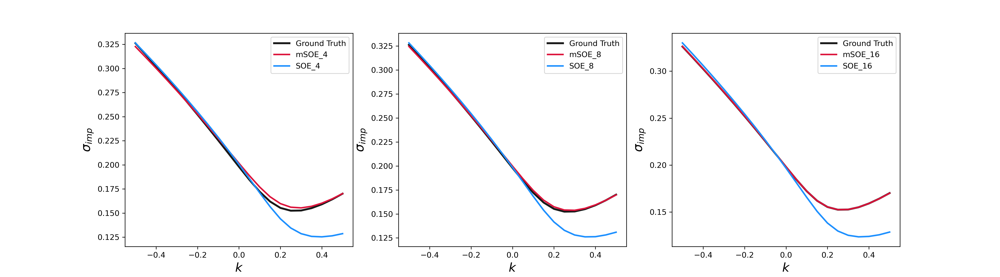
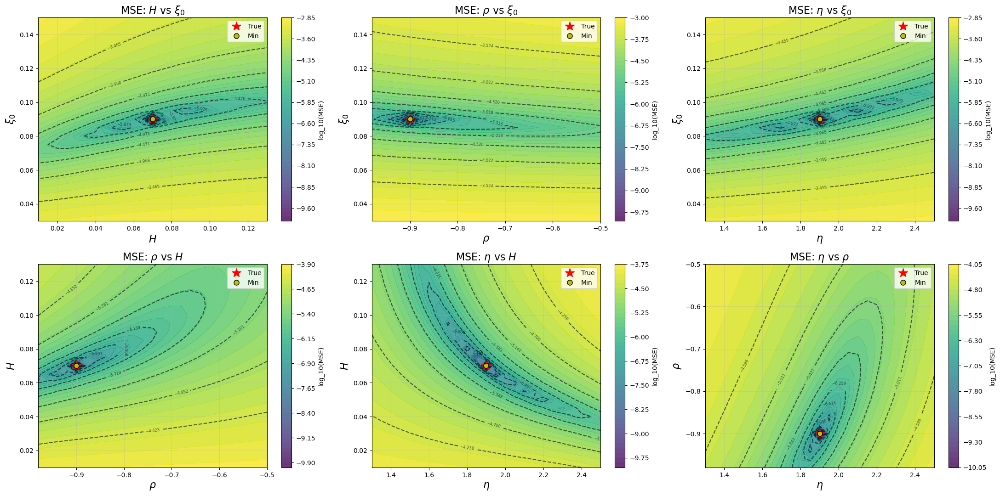
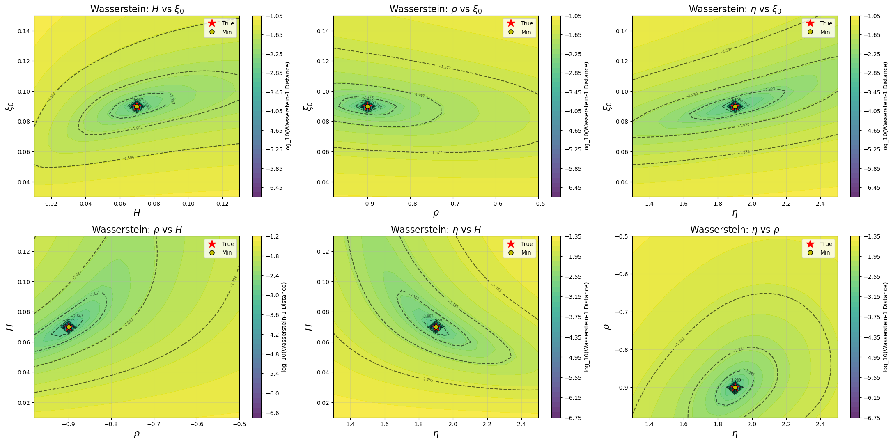

## rBergomi pricing and Tensorflow implementation of calibration with Wasserstein-1 

This repository provides the implementation of option pricing and calibration under the rough Bergomi (rBergomi) model of the paper: **Efficient Calibration in the rough Bergomi model by Wasserstein distance**.


### Option pricing

#### Four Simulation Classes

| File                 | Description                                   |
| -------------------- | --------------------------------------------- |
| `rBergomi_direct.py` | Exact simulation using Cholesky factorization |
| `rBergomi_hybrid.py` | Hybrid simulation scheme                      |
| `rBergomi_SOE.py`    | Sum-of-Exponentials (SOE) scheme              |
| `rBergomi_mSOE.py`   | Modified Sum-of-Exponentials (mSOE) scheme    |


#### Quick Start

```python
from rBergomi_mSOE import * 
from dichotomy import * 

# Get nodes and weights for the kernel approximation
Lambda, Omega = dichotomy_quad(0.5 - H, Nexp = 16, dt = 1/128, Tfinal = 1)

# Create simulator instance
mSOE = rBergomi_mSOE(
    M=128,                  # Number of time steps
    T=1,                    # Time to maturity
    params=params,          # Model parameters
    P=10000,                # Number of paths
    Lambda=Lambda,          # Quadrature nodes
    Omega=Omega,            # Quadrature weights
    cores=10,               # Number of CPU cores
    loop=1,                 # Number of loops
    rand_seed=0             # Random seed
)

# Generate final prices 
S_final = mSOE.S_final()

# Calculate European call option prices
K = np.array([0.9, 1.0, 1.1])  # Strike prices
prices = mSOE.European_price(K)
```


#### Performance

The implied volatility smiles generated by SOE and mSOE scheme, compared with the ground truth obtained by Cholesky factorization.



### Calibration 

#### Two Loss functions

| File           | Description                                                  |
| -------------- | ------------------------------------------------------------ |
| `main_mse.py`  | Minimizes the mean squared error between model and market prices |
| `main_wass.py` | Minimizes the Wasserstein-1 distance between the model and market-implied price distributions |

#### Performance

The 2-dimensional loss landscape generated by MSE and Wasserstein-1 distance.





### References 

1. Bayer, C., Friz, P., & Gatheral, J. (2016). Pricing under rough volatility. *Quantitative Finance*, *16*(6), 887-904.
2. Bennedsen, M., Lunde, A., & Pakkanen, M. S. (2017). Hybrid scheme for Brownian semistationary processes. *Finance and Stochastics*, *21*(4), 931-965.
3. Bayer, C., & Breneis, S. (2023). Markovian approximations of stochastic Volterra equations with the fractional kernel. *Quantitative Finance*, *23*(1), 53-70.